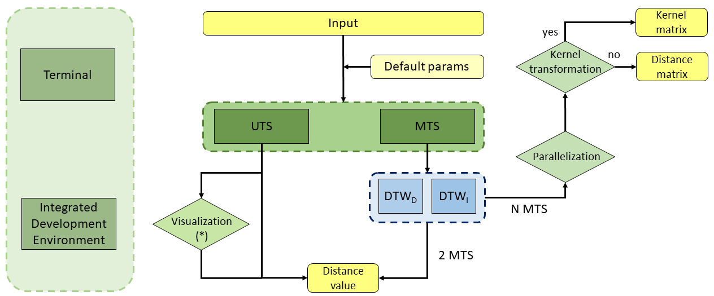
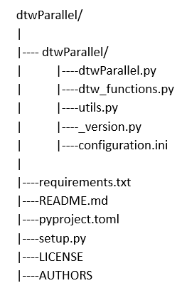
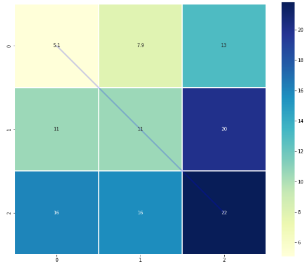
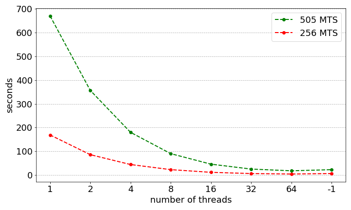
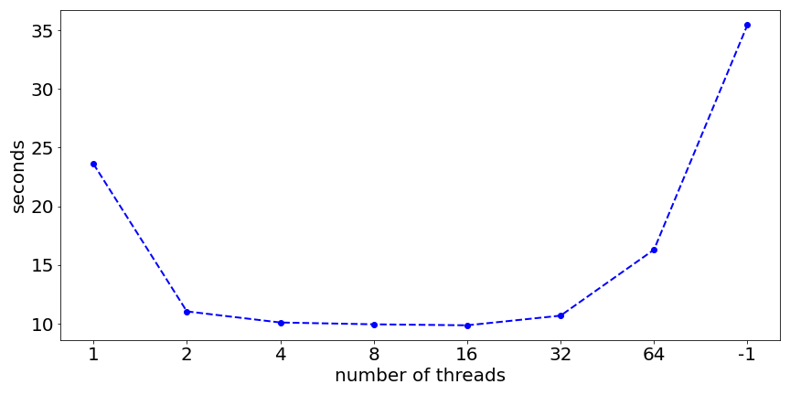
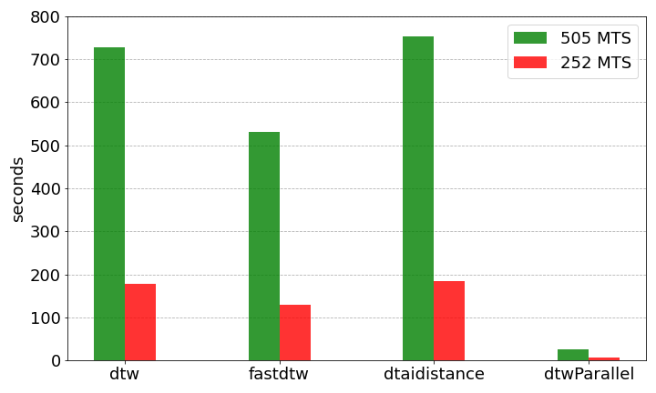

# Dynamic Time Warping 

This package allows to measure the similarity between two-time sequences, i.e., it finds the optimal alignment between two time-dependent sequences. It will enable the calculation of univariate and multivariate time series. Any distance available in `scipy.spatial.distance` and `gower` distance can be used. Extra functionality has been incorporated to transform the resulting DTW matrix into an exponential kernel.

Common functionalities for 2-time series (TS):
- It incorporates the possibility of visualizing the cost matrix and the path to reach the DTW distance value between two TS. This will allow its use in a didactic way, providing a better understanding of the method used.
- It is possible to calculate TS with the same and different lengths. 

Common functionalities for N (> 2) time series (TS):
- The calculation can be parallelized by the CPU by selecting the number of threads. As a result, we will obtain the distance matrix. 
- It is possible to perform not only the calculation of distances but also similarities (based on an exponential kernel).

Multivariate TS functionalities: 
- Calculation of dependent DTW and independent DTW is available.


## Package structure 

<p align="center">  </p>

<p align="center">  </p>


## Installation

dtwParallel can be installed using [pip](https://pip.pypa.io/en/stable/), a tool
for installing Python packages. To do it, run the following command:
```
pip install dtwParallel
```

## Requirements

dtwParallel requires Python >= 3.6.1 or later to run. For other Python
dependencies, please check the `pyproject.toml` file included
on this repository.


Note that you should have also the following packages installed in your system:
- numpy
- pandas
- matplotlib
- seaborn
- gower
- setuptools
- scipy
- joblib


## Usage

Based on the previous scheme, this package can be used in three different contexts: 

### 1) Calculation of the DTW distance with input from the terminal.
   
   The generic example is shown below:
      
      dtwParallel -x <floats> -y <floats> -d <str> -ce <bool> -of <bool>
      
   Note that only the x and y values need to be set. If not indicated, the rest of the values will be selected from the file containing the default values, ``configuration.ini``.

   Next, different uses are shown by modifying the parameters of the function:
   
   **a) Example 1.** Setting only the mandatory values.
   
   ```
   dtwParallel -x 1 2 3 -y 1 1 1
   ```
   ```
   [out]: 3.0
   ```

   **b) Example 2.** Setting all values.
   
   ```
   dtwParallel -x 1 2 3 -y 1 1 1 -d euclidean -ce True
   ```
   ```
   [out]: 3.0
   ```

   **c) Example 3.** By setting all values, modifying the distance used.
   
   ```
   dtwParallel -x 1.5 2 3.7 -y 1.4 1 1.05 -d gower -ce True
   ```
   ```
   [out]: 3.0000000596046448
   ```   

   **Remarks:**
   The calculation of the DTW distance from the command line is limited to simple examples that allow a quick understanding due to the complexity of the terminal handling:
   - Univariate time series.
   - Dependent DTW.
   - To visualize the cost matrix and the routing, it will be necessary to use an integrated development environment.

### 2) Calculation of the DTW distance with input from a file, haciendo uso de terminal.


   #### The generic example of univariate time series entered by means of ``csv files`` is shown below:
   ```
   dtwParallel <file_X> -d <str> -ce <bool> -of <bool>
   ```
   If you want to modify any of the possible values, it is necessary to modify the configuration.ini file. The possible values are those shown in [Configuration](#item1).
   
   **a) Example 1.** Calculation of univariate time series taking as input a csv file containing x and y. 

   ```
   dtwParallel exampleData/Data/E1_SyntheticData/example_1.csv
   ```
   ```      
   [out]: 40.6
   ```

   ```
   dtwParallel exampleData/Data/E1_SyntheticData/example_1.csv -d "gower"
   ```
   ```      
   [out]: 10.000000178813934
   ```
      
   #### The generic example of multivariate time series entered by means of ``csv files`` is shown below:

   ```
   dtwParallel <file_X> -d <str> -t <str> -ce <bool> -of <bool> -n <int> -k <bool> -s <float>
   ```

   **b) Example 2.** Multivariate time series computation using a csv file containing x and y as input.
   ```
   dtwParallel exampleData/Data/E1_SyntheticData/example_2.csv
   ```
   ```         
   [out]: 81.99196512684249
   ```   

   ```
   dtwParallel exampleData/Data/E1_SyntheticData/example_2.csv -d gower -t i 
   ```
   ```              
   [out]: 28.999999701976776
   ``` 

   #### The generic example for ``npy files`` is shown below:

   ```
   dtwParallel <file_X> <file_Y> -d <str> -t <str> -ce <bool> -of <bool> -n <int> -k <bool> -s <float>
   ```

   **c) Example 3.** It computes the distance to itself.
   ```
   dtwParallel exampleData/Data/E0/X_train.npy 
   ```
   ```
   [out]: [[0.00000000e+00 6.36756028e+17 2.94977907e+16 9.96457616e+17]
          [6.36756028e+17 0.00000000e+00 6.07258237e+17 1.63321364e+18]
          [2.94977907e+16 6.07258237e+17 0.00000000e+00 1.02595541e+18]
          [9.96457616e+17 1.63321364e+18 1.02595541e+18 0.00000000e+00]]
   ```
   
   **d) Example 4.** Compute the distance between X and Y.

   ```
   dtwParallel exampleData/Data/E0/X_train.npy exampleData/Data/E0/X_test.npy
   ```
   ```
   [out]: [[2.47396197e+16 9.07388652e+17 2.23522660e+17 1.68210525e+18]
          [6.12016408e+17 1.54414468e+18 8.60278687e+17 2.31886127e+18]
          [4.75817098e+15 9.36886443e+17 2.53020450e+17 1.71160304e+18]
          [1.02119724e+18 8.90689643e+16 7.72934957e+17 6.85647630e+17]]
   ```

   **e) Example 5.** Compute the gower distance between X and Y.

   ```
   dtwParallel exampleData/Data/E0/X_train.npy exampleData/Data/E0/X_test.npy -d "gower"
   ```
   ```
   [out]: [[1.7200027  2.16000016 1.92000033 2.53999992]
          [1.59999973 1.79999978 1.83999987 2.27999987]
          [0.5399895  1.52000002 1.04000024 1.66      ]
          [0.70000006 1.57999993 1.10000018 1.69999999]]
   ```

   **f) Example 6.** Compute the gower distance between X and Y and we vary the number of threads.

   ```
   dtwParallel exampleData/Data/E0/X_train.npy exampleData/Data/E0/X_test.npy -d "gower" -n 12
   ```
   ```
   [out]: [[1.7200027  2.16000016 1.92000033 2.53999992]
          [1.59999973 1.79999978 1.83999987 2.27999987]
          [0.5399895  1.52000002 1.04000024 1.66      ]
          [0.70000006 1.57999993 1.10000018 1.69999999]]
   ```

   **g) Example 7.** Compute the gower distance between X and Y and we obtain the output per file.

   ```
   dtwParallel exampleData/Data/E0/X_train.npy exampleData/Data/E0/X_test.npy -d "gower" -n 12 -of True
   ```
   ```
   [out]: output.csv
   ```


   **h) Example 8.** We calculate the distance between X and Y and transform to Gaussian kernel with sigma_kernel=0.5. 
   ```
   dtwParallel exampleData/Data/E0/X_train.npy -k True -s 1000000000
   ```
   ```
   [out]: [[1.         0.7273278  0.98535934 0.60760589]
          [0.7273278  1.         0.73813458 0.44192866]
          [0.98535934 0.73813458 1.         0.59871014]
          [0.60760589 0.44192866 0.59871014 1.        ]]
   ```

   **Remarks:**
   - You can run from any repository, but be careful! The .npy file must be found. 


### 3) Making use of the API  
   
   The generic example is shown below:

   ```
   from dtwParallel import dtw_functions
    
   # For Univariate Time Series
   dtw_functions.dtw(x,y,type_dtw, distance, MTS, get_visualization, check_errors)
   
   # For Multivariate Time Series
   dtw_functions.dtw_tensor(X_1, X_2, type_dtw, dist, n_threads, check_erros, dtw_to_kernel, sigma_kernel)
   ```

   The examples shown below are executed in jupyter-notebook. Code available in exampleData/CodeExamples/E1_SyntheticData (https://github.com/oscarescuderoarnanz/dtwParallel/tree/main/exampleData/CodeExamples/E1_SyntheticData). These examples can be executed in any Integrated Development Environment.

   **Example 1.** For univariate time series.
   ```
   from dtwParallel import dtw_functions
   from scipy.spatial import distance as d
   
   # For Univariate Time Series
   x = [1,2,3]
   y = [0,0,1]
   
   distance = d.euclidean
   dtw_functions.dtw(x,y,distance)
   ```
   ```
   [out]: 5.0
   ```

   **Example 2.** For univariate time series with different lengths.
   ```
   from dtwParallel import dtw_functions
   from scipy.spatial import distance as d
   
   # For Univariate Time Series
   x = [1,2,3,5,8,9,5,4,2]
   y = [1,0,1,0,1,1]
   
   distance = d.euclidean
   dtw_functions.dtw(x, y, distance)
   ```
   ```
   [out]: 32.0
   ```

   **Example 3.** For univariate time series with visualization.
   ```
   from dtwParallel import dtw_functions
   from scipy.spatial import distance as d
   
   # For Univariate Time Series
   x = [4,2,8,4,5]
   y = [0,1,0,8,9]
   
   distance = d.euclidean
   visualization=True
   dtw_functions.dtw(x, y, distance, get_visualization=visualization)
   ```
   ```
   [out]: 15.0
   ```

   

   **Example 4.** For multivariate time series.
   
   ```
   from dtwParallel import dtw_functions
   from scipy.spatial import distance as d
   import numpy as np
   
   X = np.array([[3,5,8], 
                [5, 1,9]])
   
   Y = np.array([[2, 0,8],
                [4, 3,8]])
               
   dtw_functions.dtw(X, Y, "d", d.euclidean, MTS=True)
   ```
   ```
   [out]: 7.548509256375962
   ```

   **Example 5.** For multivariate time series with different lengths.
   
   ```
   from dtwParallel import dtw_functions
   from scipy.spatial import distance as d
   import numpy as np

   X = np.array([[3, 5, 8], 
                 [5, 1, 9],
                 [0, 1, 1], 
                 [1, 4, 2]])

   Y = np.array([[2, 0,8],
                 [4, 3,8]])

   dtw_functions.dtw(X, Y, "d", d.euclidean, MTS=True)
   ```
   ```
   [out]: 22.546443515422986
   ```

   **Example 5.** For multivariate time series with visualization.
   
   ```
   from dtwParallel import dtw_functions
   from scipy.spatial import distance as d
   import numpy as np

   X = np.array([[3, 5, 8], 
                 [0, 1, 3],
                 [1, 2, 3]])

   Y = np.array([[2, 0, 8],
                 [1, 3, 8],
                 [4, 8, 12]])

   dtw_functions.dtw(X, Y, "d", d.euclidean, MTS=True)
   ```
   

   ```
   [out]: 22.546443515422986
   ```

   **Example 7.** For a tensor formed by N x T x F, where N is the number of observations, T the time instants and F the characteristics.
    
   ```
   import numpy as np
   from dtwParallel import dtw_functions as dtw
   
   X = np.load('../../Data/E0/X_train.npy')
   Y = np.load('../../Data/E0/X_test.npy')
   
   class Input:
       def __init__(self):
           self.check_errors = False 
           self.type_dtw = "d"
           self.MTS = True
           self.n_threads = -1
           self.distance = "gower"
           self.visualization = False
           self.output_file = True
           self.DTW_to_kernel = False
           self.sigma_kernel = 1
   
   input_obj = Input()
   # API call. 
   dtw.dtw_tensor_3d(X, Y, input_obj)
   ```
   ```
   [out]: 
   array([[2.47396197e+16, 6.12016408e+17, 4.75817098e+15, 1.02119724e+18],
       [9.07388652e+17, 1.54414468e+18, 9.36886443e+17, 8.90689643e+16],
       [2.23522660e+17, 8.60278687e+17, 2.53020450e+17, 7.72934957e+17],
       [1.68210525e+18, 2.31886127e+18, 1.71160304e+18, 6.85647630e+17]])
   ```

<a name="item1"></a>
## Configuration
For any modification of the default parameters, the ``configuration.ini`` file can be edited.

The default values are:

```
[DEFAULT]
check_errors = False
distance = euclidean
type_dtw = d
mts = False
n_threads = -1
visualization = False
output_file = False
dtw_to_kernel = False
sigma_kernel = 1
``` 

## Examples with public data

I have used data from yahoo finance (https://finance.yahoo.com/) of 505 companies, available in a .zip file. The folder where the data is located is exampleData/Data/E2_FinanceData (https://github.com/oscarescuderoarnanz/dtwParallel/tree/main/exampleData/Data/E2_FinanceData). The code needed to process the information of each of the 505 companies, obtaining the tensor input to the package is located in exampleData/CodeExamples/E2_FinanceData/tensorGenerator (https://github.com/oscarescuderoarnanz/dtwParallel/tree/main/exampleData/CodeExamples/E2_FinanceData).

### Experiment 1. Computational time as a function of the number of threads. 
The computation of the distance matrix has been carried out using dependent and independent DTW varying the number of threads. Code of this example is available at exampleData/Code/E2_FinanceData (https://github.com/oscarescuderoarnanz/dtwParallel/tree/main/exampleData/CodeExamples/E2_FinanceData).

**DTW dependent**


**DTW independent**


### Experiment 2. Comparison of computational time with other packages to calculate dependent DTW. 
Code available for this example at exampleData/Code/E2_FinanceData (https://github.com/oscarescuderoarnanz/dtwParallel/tree/main/exampleData/CodeExamples/E2_FinanceData).




## Reference 

If you use dtwParallel in your research papers, please refer to ...

[To be done]

## License

Licensed under the BSD 2-Clause License.
