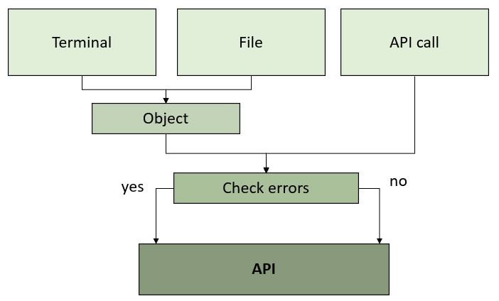

# Dynamic Time Warping 

This package allows to measure the similarity between two time sequences, i.e., it finds the optimal alignment between two time-dependent sequences. It allows the calculation for univariate and multivariate time series. Any distance available in `scipy.spatial.distance` can be used. An extra functionality has been incorporated to transform the resulting DTW matrix into an exponential kernel.

Univariate Time Series:
- It incorporates the possibility of visualising the cost matrix, as well as the path to reach the DTW distance value. This will allow it to be used in a didactic way, providing a better understanding of the method used.
- It allows the calculation for regular and irregular univariate time series.

Multivariate Time Series: 
- The calculation of dependent DTW and independent DTW is available.
- The calculation can be parallelised.
- The computation can be CPU parallelised by selecting the number of threads. 
- The distance matrix obtained can be transformed to a kernel.


## Package structure 

<p align="center">  </p>

<p align="center">  </p>


## Installation

dtwParallel can be installed using [pip](https://pip.pypa.io/en/stable/), a tool
for installing Python packages. To do it, run the following command:
```
pip3 install -i https://test.pypi.org/simple/ dtwParallel
```

## Requirements

* Python >= 3.6.1


Note that you should have also the following packages installed in your system:
- numpy
- pandas
- matplotlib
- seaborn
- gower
- setuptools
- scipy
- joblib


## Usage

Based on the previous scheme, this package can be used in three different contexts: 

### 1) Calculation of the DTW distance with input from the terminal.
   
   The generic example is shown below:
      
      dtwParallel -x <floats> -y <floats> -d <str> -ce <bool> -of <bool>
      
   Note that only the x and y values need to be set. The rest of the values, if not indicated, will be selected from the file containing the default values, ``configuration.ini``.

   Next, different uses are shown by modifying the parameters of the function:
   
   **a) Example 1.** Setting only the mandatory values.
   
   ```
   dtwParallel -x 1 2 3 -y 1 1 1
   ```
   ```
   [out]: 3.0
   ```

   **b) Example 2.** Setting all values.
   
   ```
   dtwParallel -x 1 2 3 -y 1 1 1 -d euclidean -ce True
   ```
   ```
   [out]: 3.0
   ```

   **c) Example 3.** By setting all values, modifying the distance used.
   
   ```
   dtwParallel -x 1.5 2 3.7 -y 1.4 1 1.05 -d gower -ce True
   ```
   ```
   [out]: 3.0000000596046448
   ```   

   **Remarks:**
   The calculation of the DTW distance from the command line is limited to simple examples that allow a quick understanding, due to the complexity of the terminal handling:
   - Univariate time series.
   - Dependent DTW.
   - To carry out the visualization of the cost matrix and the routing it will be necessary to make use of an integrated development environment.

### 2) Calculation of the DTW distance with input from a file, haciendo uso de terminal.


   #### The generic example of univariate time series entered by means of ``csv files`` is shown below:
   ```
   dtwParallel <file_X> -d <str> -ce <bool> -of <bool>
   ```
   In case you want to modify any of the possible values, it is necessary to carry out the modification in the configuration.ini file. The possible values are those shown in [Configuration](#item1).
   
   **a) Example 1.** Calculation of univariate time series taking as input a csv file containing x and y. 

   ```
   dtwParallel exampleData/example_1.csv
   ```
   ```      
   [out]: 40.6
   ```

   ```
   dtwParallel exampleData/example_1.csv -d "gower"
   ```
   ```      
   [out]: 10.000000178813934
   ```
      
   #### The generic example of multivariate time series entered by means of ``csv files`` is shown below:

   ```
   dtwParallel <file_X> -d <str> -t <str> -ce <bool> -of <bool> -n <int> -k <bool> -s <float>
   ```

   **b) Example 2.** Multivariate time series computation using a csv file containing x and y as input.
   ```
   dtwParallel exampleData/example_2.csv
   ```
   ```         
   [out]: 81.99196512684249
   ```   

   ```
   dtwParallel exampleData/example_2.csv -d gower -t i 
   ```
   ```              
   [out]: 9.666666567325592
   ``` 

   #### The generic example for ``npy files`` is shown below:

   ```
   dtwParallel <file_X> <file_Y> -d <str> -t <str> -ce <bool> -of <bool> -n <int> -k <bool> -s <float>
   ```

   **c) Example 3.** It computes the distance to itself.
   ```
   dtwParallel exampleData/X_train.npy 
   ```
   ```
   [out]: [[0.00000000e+00 6.36756028e+17 2.94977907e+16 9.96457616e+17]
          [6.36756028e+17 0.00000000e+00 6.07258237e+17 1.63321364e+18]
          [2.94977907e+16 6.07258237e+17 0.00000000e+00 1.02595541e+18]
          [9.96457616e+17 1.63321364e+18 1.02595541e+18 0.00000000e+00]]
   ```
   
   **d) Example 4.** Compute the distance between X and Y.

   ```
   dtwParallel exampleData/X_train.npy exampleData/X_test.npy
   ```
   ```
   [out]: [[2.47396197e+16 9.07388652e+17 2.23522660e+17 1.68210525e+18]
          [6.12016408e+17 1.54414468e+18 8.60278687e+17 2.31886127e+18]
          [4.75817098e+15 9.36886443e+17 2.53020450e+17 1.71160304e+18]
          [1.02119724e+18 8.90689643e+16 7.72934957e+17 6.85647630e+17]]
   ```

   **e) Example 5.** Compute the gower distance between X and Y.

   ```
   dtwParallel exampleData/X_train.npy exampleData/X_test.npy -d "gower"
   ```
   ```
   [out]: [[1.7200027  2.16000016 1.92000033 2.53999992]
          [1.59999973 1.79999978 1.83999987 2.27999987]
          [0.5399895  1.52000002 1.04000024 1.66      ]
          [0.70000006 1.57999993 1.10000018 1.69999999]]
   ```

   **f) Example 6.** Compute the gower distance between X and Y and we vary the number of threads.

   ```
   dtwParallel exampleData/X_train.npy exampleData/X_test.npy -d "gower" -n 12
   ```
   ```
   [out]: [[1.7200027  2.16000016 1.92000033 2.53999992]
          [1.59999973 1.79999978 1.83999987 2.27999987]
          [0.5399895  1.52000002 1.04000024 1.66      ]
          [0.70000006 1.57999993 1.10000018 1.69999999]]
   ```

   **g) Example 7.** Compute the gower distance between X and Y and we obtain the output per file.

   ```
   dtwParallel exampleData/X_train.npy exampleData/X_test.npy -d "gower" -n 12 -of True
   ```
   ```
   [out]: output.csv
   ```


   **h) Example 8.** We calculate the distance between X and Y and transform to Gaussian kernel with sigma=0.5. 
   ```
   dtwParallel exampleData/X_train.npy -k True -s 1000000000
   ```
   ```
   [out]: [[1.         0.7273278  0.98535934 0.60760589]
          [0.7273278  1.         0.73813458 0.44192866]
          [0.98535934 0.73813458 1.         0.59871014]
          [0.60760589 0.44192866 0.59871014 1.        ]]
   ```

   **Remarks:**
   - You can run from any repository, but be careful! The .npy file must be found. 


### 3) Making use of the API  
   
   The generic example is shown below:

   ```
   from dtwParallel import dtw_functions
    
   # For Univariate Time Series
   dtw_functions.dtw(x,y,type_dtw, distance, MTS, get_visualization, check_errors)
   
   # For Multivariate Time Series
   dtw_functions.dtw_tensor(X_1, X_2, type_dtw, dist, n_threads, check_erros, dtw_to_kernel, sigma)
   ```

   The examples shown below are executed in jupyter-notebook. These examples can be executed in any Integrated Development Environment.

   **Example 1.** For univariate time series.
   ```
   from dtwParallel import dtw_functions
   from scipy.spatial import distance as d
   
   # For Univariate Time Series
   x = [1,2,3]
   y = [0,0,1]
   
   distance = d.euclidean
   dtw_functions.dtw(x,y,distance)
   ```
   ```
   [out]: 5.0
   ```

   **Example 2.** For univariate time series with visualization.
   ```
   from dtwParallel import dtw_functions
   from scipy.spatial import distance as d
   
   # For Univariate Time Series
   x = [4,2,8,4,5]
   y = [0,1,0,8,9]
   
   distance = d.euclidean
   visualization=True
   dtw_functions.dtw(x,y,distance, get_visualization=visualization)
   ```
   ```
   [out]: 15.0
   ```

   

   **Example 3.** For multivariate time series.
   
   ```
   from dtwParallel import dtw_functions
   from scipy.spatial import distance as d
   import numpy as np
   
   x = np.array([[3,5,8], 
                [5, 1,9]])
   
   y = np.array([[2, 0,8],
                [4, 3,8]])
               
   dtw_functions.dtw(x,y,"d", d.euclidean, MTS=True)
   ```
   ```
   [out]: 7.548509256375962
   ```
   **Example 4.** For a tensor formed by N x T x F, where N is the number of observations, T the time instants and F the characteristics.
    
   ```
   from dtwParallel import dtw_functions
   import numpy as np
   
   x = np.load('X_train.npy')
   y = np.load('X_test.npy')
   
   dtw_functions.dtw_tensor_3d(x, y, "gower")
   ```
   ```
   [out]: 
   array([[2.47396197e+16, 6.12016408e+17, 4.75817098e+15, 1.02119724e+18],
       [9.07388652e+17, 1.54414468e+18, 9.36886443e+17, 8.90689643e+16],
       [2.23522660e+17, 8.60278687e+17, 2.53020450e+17, 7.72934957e+17],
       [1.68210525e+18, 2.31886127e+18, 1.71160304e+18, 6.85647630e+17]])
   ```

<a name="item1"></a>
## Configuration
For any modification of the default parameters, the ``configuration.ini`` file can be edited.

The default values are:

```
[DEFAULT]
check_errors = False
distance = euclidean
type_dtw = d
mts = False
n_threads = -1
visualization = False
output_file = False
dtw_to_kernel = False
sigma = 1
``` 

## Examples with public data


## Reference 

If you use dtwParallel in your research papers, please refer to ...

[To be done]

## License

Licensed under the BSD 2-Clause License.
